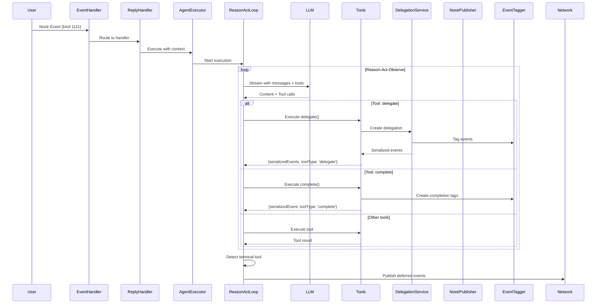
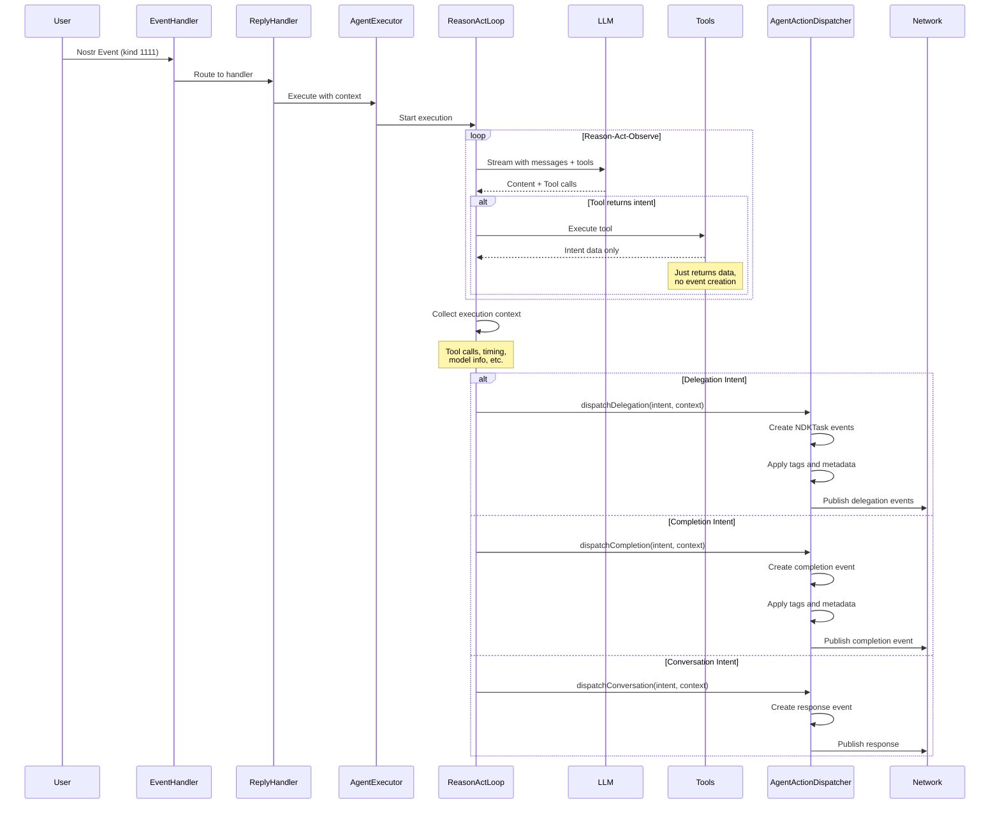
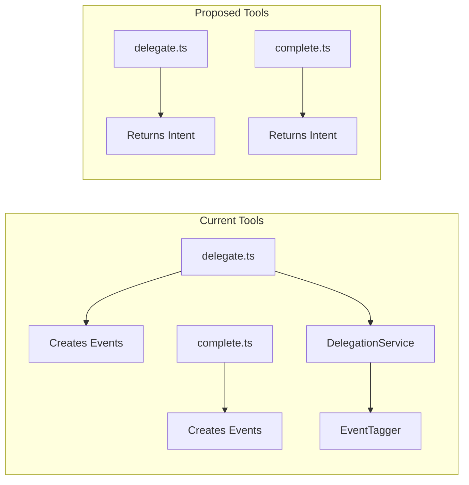
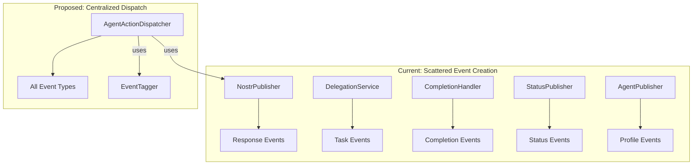
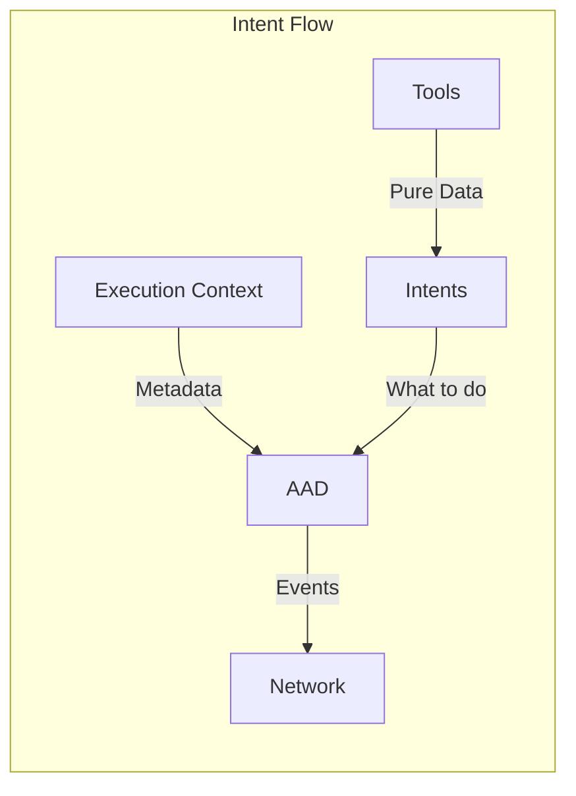
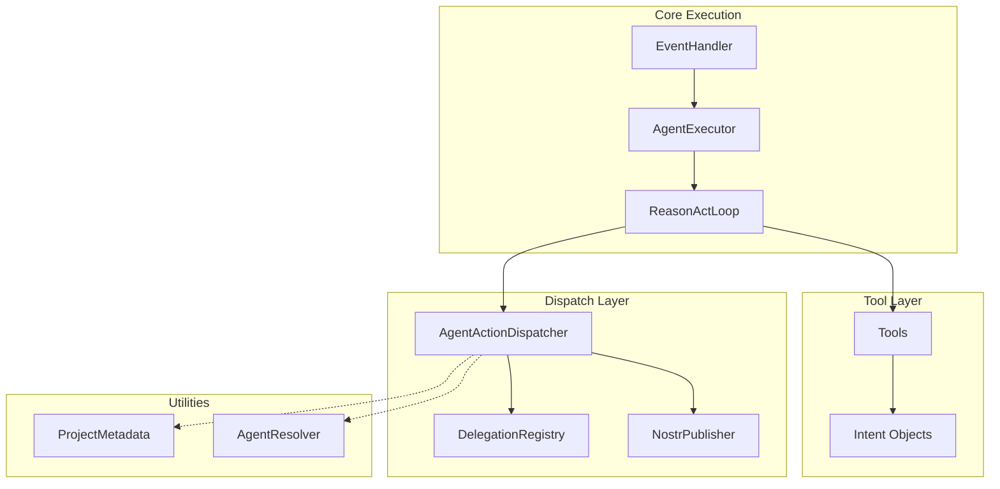
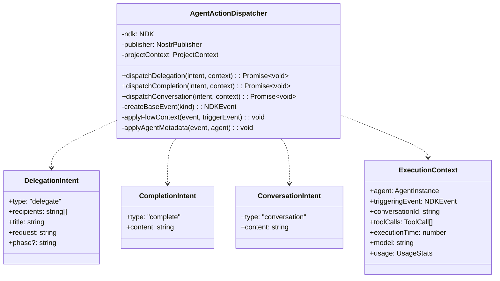
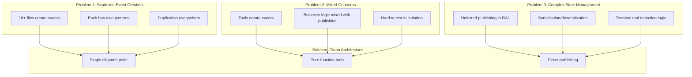

# TENEX Architecture Analysis: Current vs Proposed

## Current Architecture Flow



## Proposed Architecture Flow



## Key Architectural Changes

### 1. Tool Simplification


### 2. Event Creation Consolidation


### 3. Data Flow Clarity


## Modules to Remove/Refactor

### 1. **EventTagger** - Partially Remove
- Keep the tagging logic but move it inside AgentActionDispatcher
- No longer a separate service, becomes internal implementation detail

### 2. **DelegationService** - Refactor
- Remove event creation logic
- Keep only recipient resolution logic
- Move to a pure utility for resolving agent names/pubkeys

### 3. **CompletionHandler** - Remove
- Its event creation logic moves to AgentActionDispatcher
- RAL already handles completion detection

### 4. **Multiple Publishers** - Consolidate
- Keep NostrPublisher for low-level publishing
- Remove domain-specific publishers (StatusPublisher, etc.)
- AgentActionDispatcher handles all domain logic

## New Module Structure



## Benefits of This Architecture

1. **Clear Separation of Concerns**
   - Tools: Business logic only
   - RAL: Orchestration only
   - AAD: Event creation/publishing only

2. **Testability**
   - Tools are pure functions
   - AAD can be tested with mock publishers
   - RAL can be tested with mock AAD

3. **Extensibility**
   - New intent types are easy to add
   - Event format changes are centralized
   - Publishing strategies can evolve in one place

4. **Type Safety**
   - Intents are strongly typed
   - No serialization until the last moment
   - Context is explicitly passed

## Implementation Priority

1. **Phase 1**: Create AgentActionDispatcher
2. **Phase 2**: Refactor tools to return intents
3. **Phase 3**: Update RAL to use AAD
4. **Phase 4**: Remove obsolete modules
5. **Phase 5**: Consolidate remaining publishers

## AgentActionDispatcher Internal Design



## Example Usage in RAL

```typescript
// In ReasonActLoop after processing iteration
if (iterationResult.terminalIntent) {
    const dispatcher = new AgentActionDispatcher(
        this.ndk,
        this.publisher,
        this.projectContext
    );
    
    const executionContext = {
        agent: context.agent,
        triggeringEvent: context.triggeringEvent,
        conversationId: context.conversationId,
        toolCalls: stateManager.getToolCalls(),
        executionTime: Date.now() - startTime,
        model: finalResponse?.model,
        usage: finalResponse?.usage
    };
    
    switch (iterationResult.terminalIntent.type) {
        case 'delegate':
            await dispatcher.dispatchDelegation(
                iterationResult.terminalIntent,
                executionContext
            );
            break;
            
        case 'complete':
            await dispatcher.dispatchCompletion(
                iterationResult.terminalIntent,
                executionContext
            );
            break;
            
        case 'conversation':
            await dispatcher.dispatchConversation(
                iterationResult.terminalIntent,
                executionContext
            );
            break;
    }
}
```

## Modules That Become Obsolete

1. **EventTagger** → Logic absorbed into AgentActionDispatcher
2. **Multiple event creation points** → All consolidated
3. **Deferred publishing logic in RAL** → No longer needed
4. **Event creation in tools** → Tools become pure functions
5. **ComplexStreamPublisher logic** → Simplified or removed

## Current Architecture Problems Solved



## Critical Path for Refactoring

The key insight is that we need to:

1. **Stop** tools from creating events
2. **Start** tools returning simple intent objects
3. **Move** all event creation to AgentActionDispatcher
4. **Remove** the complex deferred publishing logic
5. **Simplify** RAL to just orchestrate and dispatch

This creates a much cleaner separation where:
- **Tools** = Pure business logic
- **RAL** = Orchestration only
- **AgentActionDispatcher** = Event creation and publishing
- **NostrPublisher** = Low-level publishing mechanics