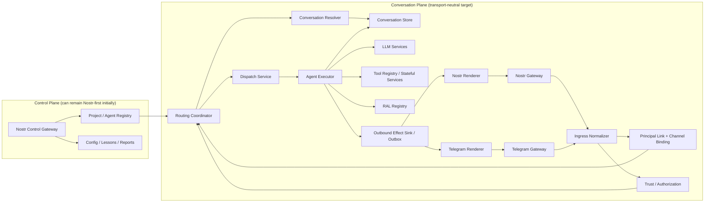

# RFC: Transport-Neutral Conversation Runtime with Nostr Identity

**Status:** Draft  
**Date:** 2026-03-13  
**Scope:** Conversation/runtime plane only for phase 1

## Summary

TENEX should preserve Nostr pubkeys as its canonical identity model while decoupling live conversation handling from Nostr event semantics and relay transport.

The proposed end state is:

- **Identity stays Nostr-based**: agents and linked humans are still represented by Nostr pubkeys and can still sign Nostr artifacts when useful.
- **Conversation transport becomes pluggable**: Nostr becomes one gateway among others, alongside Telegram and future gateways.
- **The conversation/runtime plane becomes canonical**: `AgentExecutor`, routing, RAL/delegation, and conversation persistence operate on transport-neutral envelopes and outbound effects.
- **The control plane can stay Nostr-first at the beginning**: project discovery, agent definitions, config updates, lessons, and reports do not need to be generalized in phase 1.

This RFC avoids a single massive refactor. The migration strategy is branch/worktree-based, milestone-driven, and validated through replay tests, dual-path assertions, logging, and audit scripts.

---

## Problem Statement

Today, TENEX is not merely "using Nostr as a transport". It is using Nostr as:

- the inbound message shape (`NDKEvent`)
- the outbound message shape (`kind`, `p/e/a` tags, relay publish)
- the canonical addressing model (event IDs, reply tags, author pubkeys)
- the daemon subscription/routing model (`#a`, `#p`, authors, kinds)
- part of the persisted conversation model (`pubkey`, `eventId`, targeted pubkeys)
- part of the trust and display-name model (`PubkeyGateService`, `PubkeyService`)

This makes it difficult to add alternative gateways such as Telegram DMs and Telegram groups/topics without either:

1. Translating everything into synthetic Nostr messages, or
2. Rewriting large parts of the runtime all at once.

Neither is desirable as the long-term shape.

---

## Goals

- Preserve Nostr pubkeys as the canonical identity model for agents and linked human users.
- Support multiple live communication gateways, starting with Telegram DMs and groups/topics.
- Remove direct dependence of the conversation/runtime path on `NDKEvent`, relay filters, and Nostr tags.
- Keep the migration incremental, testable, and easy to validate in a dedicated worktree branch.
- Make breakage easy to localize by introducing narrow seams and explicit milestone checks.

## Non-Goals

- Replacing Nostr identity with a transport-neutral identity system.
- Rewriting the Nostr control plane in phase 1.
- Bulk-moving modules or renaming large directory trees early in the migration.
- Designing a perfect universal abstraction for every transport feature.
- Forcing all agent-to-agent coordination to happen on user-facing transports.

---

## Architectural Principle

The conversation/runtime plane should become transport-neutral before the control plane does.

### Phase-1 rule

The following remain Nostr-first unless and until there is a strong reason to generalize them:

- project discovery and boot
- agent definitions and discovery
- config update events
- lessons and comments
- reports/articles

The following become transport-neutral:

- inbound chat messages
- routing to conversations/runtimes
- agent execution triggering
- delegation and completion bookkeeping
- ask/resume flows
- outbound agent messages and status effects

This keeps the blast radius small while still unlocking Telegram and future gateways.

---

## Current-State Coupling Map

The current conversation/runtime path roughly looks like this:

```text
NDK subscriptions
  -> EventHandler
  -> ConversationResolver / AgentDispatchService
  -> AgentExecutor
  -> AgentPublisher
  -> Nostr relays
```

Representative modules:

- `src/daemon/SubscriptionManager.ts`
- `src/daemon/filters/SubscriptionFilterBuilder.ts`
- `src/event-handler/index.ts`
- `src/conversations/services/ConversationResolver.ts`
- `src/services/dispatch/AgentDispatchService.ts`
- `src/agents/execution/AgentExecutor.ts`
- `src/nostr/AgentPublisher.ts`
- `src/nostr/AgentEventEncoder.ts`

Representative coupling points:

- `AgentExecutor` currently emits through `AgentPublisher`, which is Nostr-native.
- `EventHandler` and daemon routing are driven by Nostr kinds and tags.
- `ConversationResolver` identifies threads and new conversations using Nostr reply/mention semantics.
- `ConversationStore` persists records shaped around pubkeys and event IDs.
- `PubkeyService` and `PubkeyGateService` assume Nostr-authored traffic.

---

## Proposed Split

The target split is:

- **Identity Layer**: Nostr pubkeys remain canonical.
- **Transport Gateways**: Nostr, Telegram, and future integrations own external protocol concerns.
- **Canonical Runtime Layer**: routing, conversations, dispatch, RAL, execution, and outbox run on neutral types.
- **Transport Renderers**: render canonical outbound effects into Nostr events, Telegram messages, etc.

### Design rule

The core runtime should not know:

- what a relay is
- what a Telegram update is
- what `p/e/a` tags are
- what a `chat_id` or `message_thread_id` is

The core runtime should know:

- who the principal is
- what channel/context the message came from
- which conversation it belongs to
- who should react
- what outbound effects the runtime wants to produce

---

## Canonical Runtime Concepts

These are conceptual shapes, not final code:

| Concept | Purpose |
| --- | --- |
| `PrincipalRef` | Canonical actor identity. In phase 1 this is still a Nostr pubkey-backed principal. |
| `ChannelRef` | External communication surface such as Telegram DM, Telegram group/topic, or Nostr thread. |
| `ExternalMessageRef` | A transport-specific pointer like `nostr:<eventId>` or `telegram:<chatId>:<messageId>`. |
| `InboundEnvelope` | Canonical inbound message passed into runtime orchestration. |
| `OutboundEffect` | Canonical "thing the runtime wants to emit" before rendering to any transport. |
| `ConversationRef` | Internal conversation identity independent from external transport IDs. |
| `ChannelBinding` | Mapping from external channel/topic to project/runtime context. |
| `PrincipalLink` | Mapping from external transport account to canonical principal/pubkey. |

### Important phase-1 choice

`PrincipalRef` can still embed Nostr identity:

- agent principal: `nostr:<pubkey>`
- linked human principal: `nostr:<pubkey>`

Telegram is therefore a **channel**, not the source of truth for identity.

---

## High-Level Graph



### Responsibilities

| Module | Responsibility | Likely current antecedent |
| --- | --- | --- |
| `Nostr Gateway` | Nostr IO, relay subscriptions, publish delivery, dedupe | `daemon/SubscriptionManager`, `nostr/ndkClient`, `AgentPublisher` |
| `Telegram Gateway` | Telegram webhook/polling IO, rate limiting, retries, dedupe | new |
| `Ingress Normalizer` | Convert raw transport payload into canonical `InboundEnvelope` | parts of `AgentEventDecoder`, `TagExtractor`, `EventHandler` |
| `Principal Link + Channel Binding` | Resolve external account/channel into canonical principal and project binding | new, informed by `PubkeyService` and daemon routing |
| `Trust / Authorization` | Decide whether inbound traffic is allowed to affect the runtime | evolves from `PubkeyGateService` |
| `Routing Coordinator` | Pick project/runtime target and choose control-plane vs conversation-plane flow | parts of `DaemonRouter`, `EventHandler` |
| `Conversation Resolver` | Find or create internal conversation context from canonical fields | `conversations/services/ConversationResolver` |
| `Conversation Store` | Persist transcript, metadata, bindings, refs, and conversation state | `ConversationStore` |
| `Dispatch Service` | Decide which agent(s) should react and how | `services/dispatch/AgentDispatchService` |
| `Agent Executor` | Run agent loop and produce canonical outbound effects | `agents/execution/AgentExecutor` |
| `LLM Services` | Model requests, streaming, usage, retries | `llm/` |
| `Tool Registry / Stateful Services` | Execute tools and own long-lived integrations | `tools/`, `services/` |
| `RAL Registry` | Track in-flight reasoning/action loops and delegation state | `services/ral/RALRegistry` |
| `Outbound Effect Sink / Outbox` | Canonical queue/log of effects the runtime wants to emit | new |
| `Nostr Renderer` | Render outbound effects into Nostr events/tags | evolves from `AgentEventEncoder`/`AgentPublisher` |
| `Telegram Renderer` | Render outbound effects into Telegram messages/edits/actions | new |

---

## Branch/Worktree Working Model

This migration is intended to happen in a dedicated git worktree on a dedicated branch.

That means:

- no production feature flags are required for branch-local milestones
- each milestone should leave the branch in a testable, reviewable, revertible state
- validation should come from tests, audit scripts, replay comparisons, and telemetry

### Working rule

Each milestone should end with:

- code changes that compile and run
- explicit success criteria
- a repeatable validation command or script
- enough logging/telemetry to understand parity or drift

---

## Module Strategy

This RFC recommends **adding seams before moving files**.

### Early migration rule

Do not immediately move `src/nostr/` into a new transport directory.

Instead:

- add transport-neutral contracts first
- make current Nostr modules implement those contracts
- move/rename modules only after the contracts are stable

This keeps blame/history clean and reduces risk.

### Suggested eventual module shape

Possible end state:

```text
src/
  transports/
    core/
    nostr/
    telegram/
  services/
    ingress/
    outbox/
    principal-links/
    channel-bindings/
    trust/
  conversations/
  agents/
  llm/
  tools/
```

### Suggested migration shape

Practical first steps:

- keep `src/nostr/` where it is
- add transport-neutral interfaces in a small new layer-2 module
- wrap Nostr behind those interfaces
- add Telegram later without changing runtime entry points

---

## Milestones

The milestones below assume the work stays on a dedicated branch until each checkpoint is stable.

### Milestone 1: Baseline Validation and Outbound Seam

**Objective**

Make the executor/runtime depend on a neutral publisher contract instead of the concrete `AgentPublisher` type wherever possible, while adding audit tooling to prove progress.

**Changes**

- add a layer-2 `AgentRuntimePublisher` contract
- make `AgentPublisher` implement that contract
- switch runtime/tool-facing contexts and trackers to depend on the contract instead of the concrete class
- add an audit script that reports:
  - remaining direct imports of `AgentPublisher`
  - new imports of `AgentRuntimePublisher`
  - unexpected regressions in production code
- add executor logging/telemetry that reports which publisher implementation is active

**Success criteria**

- production runtime/tool context types no longer require the concrete `AgentPublisher` class
- the only remaining concrete imports of `AgentPublisher` in production code are explicit construction points or Nostr-native modules
- existing execution tests still pass
- the audit script passes in strict mode

**Validation**

- `bun run audit:transport-runtime`
- targeted execution tests
- `bun run typecheck`

### Milestone 2: Canonical Inbound Envelope and Ingress Orchestration

**Objective**

Introduce a transport-neutral inbound envelope and route Nostr traffic through it without changing behavior.

**Changes**

- define canonical inbound concepts:
  - `PrincipalRef`
  - `ChannelRef`
  - `ExternalMessageRef`
  - `InboundEnvelope`
- add a `NostrInboundAdapter`
- introduce a canonical ingress orchestration path
- preserve raw Nostr context as attached legacy payload while migration is underway
- add comparison logging between legacy and canonical routing/conversation decisions during the milestone

**Success criteria**

- Nostr messages enter the runtime through the canonical ingress layer
- route and conversation decisions remain identical to current behavior
- comparison logs remain clean on golden flows

**Validation**

- replay script over captured Nostr event sequences
- golden-path integration tests
- route/conversation diff logs

### Milestone 3: Canonical Conversation Persistence

**Objective**

Make conversation persistence transport-aware without breaking existing data or runtime behavior.

**Changes**

- extend conversation records with:
  - internal message ID
  - external message refs
  - sender principal ref
  - channel ref
  - reply refs
- keep compatibility with current `pubkey` and `eventId`-based persistence
- add parity checks when old and new fields are both present
- add a conversation audit or migration-check script

**Success criteria**

- old conversations still load cleanly
- new conversations persist both canonical and compatibility data
- parity checks show no drift on milestone scenarios

**Validation**

- conversation persistence tests
- replayed conversations before/after save-load cycles
- audit/migration-check script

### Milestone 4: Principal Links and Channel Bindings

**Objective**

Separate identity resolution from transport handling while preserving pubkeys as canonical identity.

**Changes**

- add `PrincipalLinkService`
- add `ChannelBindingService`
- generalize trust checks so they still resolve to pubkeys but are no longer tied to Nostr-originated traffic only
- add telemetry for unresolved links, unbound channels, and authorization failures

**Success criteria**

- the runtime can resolve a linked principal and a bound channel independently of Nostr transport shape
- errors for missing links/bindings are explicit and observable

**Validation**

- unit tests for link/binding resolution
- telemetry logs for failure modes
- end-to-end dry-run commands or fixtures

### Milestone 5: Telegram DM and Then Groups/Topics

**Objective**

Add Telegram as a new conversation gateway after the runtime plane is ready.

**Changes**

- Telegram DM support first:
  - linked users only
  - one bound project per DM
  - text-first delivery
- then Telegram groups/topics:
  - explicit channel binding
  - mention/reply rules
  - rate-limited rendering and output coalescing
- keep one external bot persona with internal agent attribution labels

**Success criteria**

- Telegram DM can drive the same internal runtime path as Nostr
- Telegram group/topic support can exercise normal routing, delegation, and ask/resume flows without transport-specific hacks in the core runtime

**Validation**

- end-to-end gateway tests
- transcript parity checks against Nostr golden flows where applicable
- delivery/outbox logs

---

## How to Minimize Risk and Localize Breakage

### 1. Replay harnesses over real flows

Build replay runners for captured Nostr event sequences so you can compare:

- route target
- conversation selection/creation
- resulting transcript
- pending/completed delegations
- outbound publications

### 2. Dual-path assertions during milestones

When introducing a new canonical seam:

- compute the new result
- compare it against the old result inside the branch
- log diffs explicitly
- only remove the old path after the diff stream is clean

### 3. Compatibility-first persistence

For conversation storage:

- write canonical fields alongside compatibility fields
- verify parity during save/load cycles
- keep migration scripts and audit commands small and explicit

### 4. Invariants and assertions

Add runtime assertions for:

- every inbound envelope resolves to exactly one principal
- every inbound envelope resolves to exactly one bound channel
- every conversation message has a stable internal ID
- every pending delegation eventually completes or aborts
- every completion maps back to one conversation context
- every outbound effect reaches a terminal delivery state

### 5. Dead-letter handling for transport delivery

Outbox deliveries should have explicit terminal states:

- delivered
- failed-retryable
- failed-terminal
- dropped-by-policy

This makes transport failures visible instead of silent.

---

## Transport-Specific Guidance for Telegram

This RFC assumes:

- Telegram is a **channel**, not the identity source of truth.
- Human identity should resolve through an explicit Telegram-account-to-pubkey link.
- Groups/topics must be explicitly bound to projects/runtimes.
- Internal multi-agent behavior should not depend on separate Telegram bots talking to one another.

Strong recommendation:

- use one Telegram bot gateway per external surface
- attribute responses to internal agents in message content/formatting
- do not model internal agents as separate Telegram bots

This keeps the internal runtime independent from Telegram bot limitations.

---

## Open Questions

- Should Telegram-originated conversations optionally be mirrored back to Nostr for audit/history?
- What is the linking UX for Telegram user -> Nostr pubkey?
- How should unlinked Telegram users in groups be handled: reject, limited guest mode, or temporary principal?
- Which outbound effects are canonical in phase 1:
  - plain text
  - typing/streaming
  - question blocks
  - attachments
  - message edits
- Should agent-to-agent traffic ever be projected to Telegram, or should Telegram remain human-facing only?

---

## Recommendation

Proceed with the conversation/runtime split first.

Do **not** attempt to make the entire codebase transport-neutral in one shot.

If the above plan is followed, the earliest transport-neutral architecture can emerge with:

- minimal behavior change in the Nostr path
- milestone-local validation in the dedicated branch/worktree
- fast break detection through replay and audit tooling
- a clear path to Telegram DMs first, then Telegram groups/topics

That is the safest route to a multi-gateway TENEX while preserving Nostr identity.
