```mermaid
flowchart TB
    AE[AgentExecutor] -->|"Give me messages"| MBS[MessageBridgeService]

    MBS --> KNOWS["Knows:<br/>• Provider capabilities<br/>• Session state<br/>• Checkpoint<br/>• Delta vs full logic"]

    MBS -->|"reads"| CS[ConversationStore]

    AE -.->|"stays clean"| CLEAN["AgentExecutor just asks<br/>for messages and gets them"]

    style MBS fill:#9b59b6,color:#fff
    style CLEAN fill:#2ecc71,color:#fff
```

# Message History Deduplication Architecture Analysis

> Handling Provider-Specific History Management in TENEX

## Table of Contents

1. [Problem Statement](#problem-statement)
2. [Current Architecture](#current-architecture)
3. [Design Constraints](#design-constraints)
4. [Proposal 1: Provider Capability Interface](#proposal-1-provider-capability-interface)
5. [Proposal 2: Delta Message Strategy](#proposal-2-delta-message-strategy)
6. [Proposal 3: Message Bridge Service](#proposal-3-message-bridge-service)
7. [Proposal 4: Dual-Mode Message Building](#proposal-4-dual-mode-message-building)
8. [Proposal 5: Session Boundary Markers](#proposal-5-session-boundary-markers)
9. [Comparison Matrix](#comparison-matrix)
10. [Recommendation](#recommendation)

---

## Problem Statement

Claude Code maintains its own internal conversation history through session resumption (`resume: sessionId`). Meanwhile, TENEX sends the full message history via the `messages[]` array to support providers that don't maintain state (Ollama, OpenRouter, etc.).

**Result:** When resuming a Claude Code session, the conversation history is duplicated — once from Claude Code's internal state, once from the messages array TENEX sends.


### Why This Matters

- **Token waste:** Duplicate messages consume context window unnecessarily
- **Confusion:** Model may see contradictory or confusing duplicate context
- **Cost:** More tokens = higher API costs
- **Degraded quality:** Duplicates can confuse the model's understanding of conversation state

---

## Current Architecture

### Message Flow

```mermaid
flowchart TB
    CS[ConversationStore] -->|buildMessagesForRal| MSG["messages[]"]
    MSG -->|prepareMessagesForRequest| LLM[LLMService.stream]

    LLM --> CHECK{Claude Code?}
    CHECK -->|Yes| RESUME["options.resume = sessionId<br/>BUT still sends full messages[]"]
    CHECK -->|No| FULL["Send full messages[]"]

    RESUME --> PROBLEM["⚠️ DUPLICATION"]

    style PROBLEM fill:#e74c3c,color:#fff
```



### Key Components

| Component | Responsibility |
|-----------|---------------|
| `AgentExecutor.executeStreaming()` | Builds messages from ConversationStore |
| `ConversationStore.buildMessagesForRal()` | Single source of truth for conversation |
| `LLMService.prepareMessagesForRequest()` | Applies provider-specific transforms |
| `SessionManager` | Tracks session IDs and last sent event IDs |
| `ClaudeCodeProvider` | Creates model with `resume` option |

### Provider Capabilities (Already Defined)

```typescript
// src/llm/providers/types.ts
export interface ProviderCapabilities {
    streaming: boolean;
    toolCalling: boolean;
    builtInTools: boolean;
    sessionResumption: boolean;  // ← Key capability!
    requiresApiKey: boolean;
    mcpSupport: boolean;
}
```

---

## Design Constraints

> **Your Stated Preference:**
> "It's probably better to not completely do away with Claude Code's internal message history, since it's probably built in a way that works better for Claude Code than what we can achieve; if we go that route we'll be chasing a moving target."

### Must-Have Requirements

- **Support message injection:** Supervision corrections, delegation results, etc. must still be injectable
- **Work with all providers:** Ollama, OpenRouter still need full history
- **Preserve Claude Code's session benefits:** Don't replace its internal history management
- **Keep AgentExecutor manageable:** Don't add more complexity to the already complex file

### Nice-to-Have

- Minimal changes to existing code
- Clean separation of concerns
- Testable in isolation

---

## Proposal 1: Provider Capability Interface

**Complexity: 🟢 Low**

Extend the existing `ProviderCapabilities` interface with a new property indicating how the provider handles history. Message building logic adapts based on this.

### Implementation

```typescript
// Extend ProviderCapabilities
interface ProviderCapabilities {
    // ... existing
    historyManagement: 'stateless' | 'session-stateful';
}

// In buildMessagesForRal or prepareMessagesForRequest
if (provider.capabilities.historyManagement === 'session-stateful' && sessionId) {
    // Only send messages since last checkpoint
    return buildDeltaMessages(conversationStore, lastCheckpoint);
} else {
    // Send full history
    return buildFullMessages(conversationStore);
}
```


### Pros & Cons

| ✅ Pros | ❌ Cons |
|---------|---------|
| Uses existing capability system | Still requires checkpoint tracking somewhere |
| Minimal code changes | Doesn't address WHERE the delta logic lives |
| Easy to extend for future providers | May need to be combined with another approach |
| Self-documenting (capability name explains behavior) | |

---

## Proposal 2: Delta Message Strategy

**Complexity: 🟡 Medium**

Track a "checkpoint" (message index or event ID) marking what Claude Code has already seen. When resuming a session, only send messages after the checkpoint.

### Implementation

```typescript
// Extend SessionManager or create MessageCheckpointService
interface SessionData {
    sessionId?: string;
    lastSentEventId?: string;
    lastMessageIndex?: number;  // ← New: checkpoint marker
}

// In message building
async buildMessagesForRal(
    agentPubkey: string,
    ralNumber: number,
    options?: { afterCheckpoint?: number }
): Promise<ModelMessage[]> {
    const startIndex = options?.afterCheckpoint ?? 0;
    // Only build messages from startIndex onwards
    const messages = this.state.messages.slice(startIndex);
    // ... rest of building logic
}
```



```mermaid
flowchart TB
    subgraph Session1["Session 1 (Initial)"]
        S1M0["[0] System prompt"]
        S1M1["[1] User: Help me..."]
        S1M2["[2] Assistant: Sure..."]
        S1M3["[3] Tool call"]
        S1M4["[4] Tool result"]
        S1M5["[5] Assistant: Done"]
        CP["📍 Checkpoint saved: 5"]
    end

    subgraph Session2["Session 2 (Resume)"]
        S2M6["[6] User: Now add X"]
        S2M7["[7] Injected: supervision"]
    end

    Session1 -->|"All sent"| CC1["Claude Code<br/>(stores internally)"]
    Session2 -->|"Only delta"| CC2["Claude Code<br/>(resumes + delta)"]

    CC1 --> RESULT["Claude Code sees:<br/>Internal[0-5] + Delta[6-7]<br/>= Complete History ✅"]
    CC2 --> RESULT

    style CP fill:#2ecc71,color:#fff
    style RESULT fill:#3498db,color:#fff
```

### Injection Handling

Injections (supervision corrections, delegation results) are added AFTER the checkpoint is saved, so they're always included in the delta. This naturally works with the existing `queueUserMessage`/`queueSystemMessage` flow.

### Pros & Cons

| ✅ Pros | ❌ Cons |
|---------|---------|
| Simple concept: checkpoint + delta | Checkpoint tracking adds state complexity |
| Works naturally with injections | Edge case: What if checkpoint is invalid/stale? |
| Can extend existing SessionManager | Must handle session invalidation (workingDirectory change) |
| No new services needed | |

---

## Proposal 3: Message Bridge Service

**Complexity: 🔴 High**

Create a new service that sits between AgentExecutor and LLMService, responsible for mediating message building based on provider capabilities.

### Implementation

```typescript
// New service: src/services/llm/MessageBridgeService.ts
export class MessageBridgeService {
    constructor(
        private conversationStore: ConversationStore,
        private sessionManager: SessionManager,
        private providerCapabilities: ProviderCapabilities
    ) {}

    async buildMessages(
        agentPubkey: string,
        ralNumber: number
    ): Promise<ModelMessage[]> {
        if (this.shouldSendDelta()) {
            return this.buildDeltaMessages(agentPubkey, ralNumber);
        }
        return this.buildFullMessages(agentPubkey, ralNumber);
    }

    private shouldSendDelta(): boolean {
        return (
            this.providerCapabilities.sessionResumption &&
            this.sessionManager.hasActiveSession()
        );
    }
}
```



### Pros & Cons

| ✅ Pros | ❌ Cons |
|---------|---------|
| Complete separation of concerns | New service = more files, more indirection |
| AgentExecutor stays clean | Risk of over-engineering |
| Testable in isolation | Need to thread through dependencies |
| Single place for all history logic | Higher initial implementation cost |
| Easy to add new provider behaviors | |

---

## Proposal 4: Dual-Mode Message Building

**Complexity: 🟡 Medium**

Modify `ConversationStore.buildMessagesForRal()` to accept a mode parameter. The mode is determined by the caller based on provider capabilities.

### Implementation

```typescript
// Extend ConversationStore
type MessageBuildMode = 'full' | 'delta';

interface MessageBuildOptions {
    mode: MessageBuildMode;
    checkpointMessageIndex?: number;
    includeSystemPrompt: boolean;
}

async buildMessagesForRal(
    agentPubkey: string,
    ralNumber: number,
    options: MessageBuildOptions = { mode: 'full', includeSystemPrompt: true }
): Promise<ModelMessage[]> {
    if (options.mode === 'delta' && options.checkpointMessageIndex !== undefined) {
        // Build only messages after checkpoint
        const deltaMessages = this.state.messages.slice(options.checkpointMessageIndex + 1);
        // ... convert to ModelMessage[]
    }
    // ... existing full history logic
}
```


### Pros & Cons

| ✅ Pros | ❌ Cons |
|---------|---------|
| Extends existing code naturally | ConversationStore gains more responsibility |
| No new services | Caller must understand provider capabilities |
| ConversationStore already owns message building | Checkpoint tracking still needs a home |
| Backward compatible (default = 'full') | |

---

## Proposal 5: Session Boundary Markers

**Complexity: 🟢 Low**

Instead of tracking checkpoints externally, embed "session boundary" markers in the conversation store itself.

### Implementation

```typescript
// Extend ConversationEntry
interface ConversationEntry {
    // ... existing fields
    isSessionBoundary?: boolean;  // Marks end of a session
}

// When session completes
conversationStore.markSessionBoundary(agentPubkey, ralNumber);

// When building messages for resume
buildMessagesForRal(agentPubkey, ralNumber, { skipBeforeBoundary: true })
```


### Pros & Cons

| ✅ Pros | ❌ Cons |
|---------|---------|
| Self-contained in ConversationStore | Pollutes message history with markers |
| No external state tracking | Must handle marker visibility in UI |
| Survives daemon restarts (persisted) | Doesn't work if session was never cleanly ended |
| Simple conceptual model | |

---

## Comparison Matrix

| Criteria | P1: Capability | P2: Delta | P3: Bridge | P4: Dual-Mode | P5: Boundary |
|----------|---------------|-----------|------------|---------------|--------------|
| **Complexity** | 🟢 Low | 🟡 Medium | 🔴 High | 🟡 Medium | 🟢 Low |
| **AgentExecutor Changes** | Minimal | Small | Moderate | Small | Small |
| **Testability** | Good | Good | Excellent | Good | Fair |
| **Future Provider Support** | Excellent | Good | Excellent | Good | Fair |
| **Injection Handling** | N/A (pattern only) | Natural | Explicit | Natural | Natural |
| **State Persistence** | N/A | SessionManager | Service | External | ConversationStore |

---

## Recommendation: Hybrid Approach (P1 + P2 + P4)

After analyzing all options, I recommend combining three proposals into a cohesive solution that balances simplicity, maintainability, and extensibility.

### Implementation Strategy

1. **Extend ProviderCapabilities (P1):** Add `historyManagement: 'stateless' | 'session-stateful'` to make provider behavior explicit
2. **Track Checkpoint in SessionManager (P2):** Extend `SessionData` with `lastMessageIndex` to know where we left off
3. **Add Mode to ConversationStore (P4):** Extend `buildMessagesForRal()` with `{ mode: 'delta', afterIndex: N }`

### Implementation Outline

```typescript
// Step 1: Extend ProviderCapabilities
interface ProviderCapabilities {
    // ... existing
    historyManagement: 'stateless' | 'session-stateful';
}

// Step 2: Extend SessionData
interface SessionData {
    sessionId?: string;
    lastSentEventId?: string;
    lastMessageIndex?: number;  // NEW: Checkpoint
}

// Step 3: Extend buildMessagesForRal
interface MessageBuildOptions {
    afterMessageIndex?: number;  // For delta mode
}

// Step 4: In AgentExecutor.executeStreaming()
const session = sessionManager.getSession();
const isStateful = provider.capabilities.historyManagement === 'session-stateful';

const messages = isStateful && session.sessionId
    ? await conversationStore.buildMessagesForRal(
        agentPubkey,
        ralNumber,
        { afterMessageIndex: session.lastMessageIndex }
      )
    : await conversationStore.buildMessagesForRal(agentPubkey, ralNumber);

// Step 5: Update checkpoint after successful execution
sessionManager.setCheckpoint(conversationStore.getMessageCount() - 1);
```

### Complete Flow


### Why This Approach

- **Minimal new code:** No new services, just extends existing components
- **Clear intent:** Provider capabilities document the behavior
- **Keeps AgentExecutor clean:** Just a few lines to check capability and pass options
- **Injection-friendly:** Injections are always added after checkpoint, so naturally included
- **Testable:** Each piece (capability check, checkpoint tracking, delta building) testable independently

### Files to Modify

1. `src/llm/providers/types.ts` - Add `historyManagement` capability
2. `src/llm/providers/agent/ClaudeCodeProvider.ts` - Set capability
3. `src/agents/execution/SessionManager.ts` - Add checkpoint tracking
4. `src/conversations/ConversationStore.ts` - Add delta mode to `buildMessagesForRal`
5. `src/agents/execution/AgentExecutor.ts` - Use capability to choose mode

### Edge Cases to Handle

| Edge Case | Solution |
|-----------|----------|
| Invalid checkpoint (> message count) | Fall back to full history |
| Session invalidation (workingDirectory change) | Already handled by SessionManager |
| First message in session | No checkpoint → full history |
| Daemon restart | SessionManager loads from disk, checkpoint restored |

---

*Generated for TENEX Architecture Analysis • January 2026*
