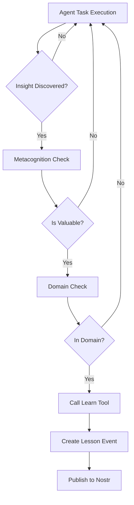
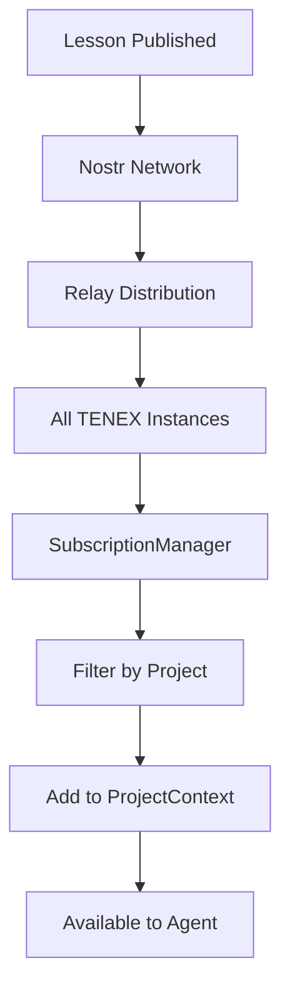
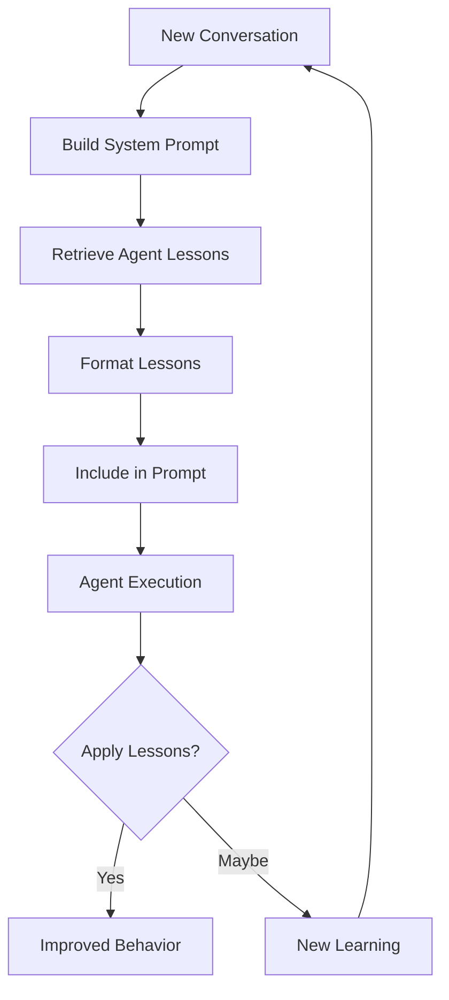

# Learning System Internal Architecture

## Executive Summary

The Learning System is TENEX's sophisticated knowledge persistence and evolution mechanism that enables agents to capture, store, retrieve, and apply lessons learned during task execution. This architecture implements a distributed learning paradigm where each agent maintains its own knowledge base of up to 50 lessons, persisted through Nostr events (NDKAgentLesson kind 4129), with built-in quality control through metacognition checks and domain boundary enforcement. The system seamlessly integrates lessons into agent prompts, creating a continuous improvement loop where agents become more effective over time by learning from their experiences and avoiding past mistakes.

## Table of Contents

1. [Core Architecture Philosophy](#core-architecture-philosophy)
2. [System Components](#system-components)
3. [Data Flow Architecture](#data-flow-architecture)
4. [Learning Lifecycle](#learning-lifecycle)
5. [Quality Control Mechanisms](#quality-control-mechanisms)
6. [Storage and Persistence](#storage-and-persistence)
7. [Integration with Agent System](#integration-with-agent-system)
8. [Lesson Event Protocol](#lesson-event-protocol)
9. [Prompt Integration Architecture](#prompt-integration-architecture)
10. [Analytics and Metrics](#analytics-and-metrics)
11. [Performance Considerations](#performance-considerations)
12. [Security and Privacy](#security-and-privacy)
13. [Limitations and Trade-offs](#limitations-and-trade-offs)
14. [Future Architecture Considerations](#future-architecture-considerations)
15. [Open Questions](#open-questions)

## Core Architecture Philosophy

The Learning System embodies several critical architectural principles:

### 1. **Agent-Scoped Learning**
Each agent maintains its own isolated knowledge base, preventing cross-contamination of domain-specific insights. An orchestrator doesn't learn coding patterns, and an executor doesn't learn routing strategies.

### 2. **Quality Over Quantity**
The system enforces a 50-lesson limit per agent, prioritizing high-value insights over exhaustive knowledge accumulation. This constraint forces natural knowledge evolution where outdated lessons are replaced by newer, more relevant ones.

### 3. **Metacognitive Validation**
Before recording any lesson, agents must engage in explicit metacognition - reasoning about whether the lesson is truly valuable. This prevents pollution of the knowledge base with trivial observations.

### 4. **Distributed Persistence**
Lessons are persisted as Nostr events, providing decentralized, tamper-resistant storage that survives beyond individual TENEX instances and can be shared across deployments.

### 5. **Seamless Integration**
Lessons are automatically injected into agent prompts without requiring explicit retrieval, creating a transparent augmentation of agent capabilities.

## System Components

### 1. NDKAgentLesson Event Type (`src/events/NDKAgentLesson.ts`)

The fundamental data structure for lesson persistence:

```typescript
class NDKAgentLesson extends NDKEvent {
    static kind = 4129;  // Unique Nostr event kind
    
    // Core properties
    title: string;           // Brief description
    lesson: string;          // Actual lesson content (in event.content)
    quality: LessonQuality;  // TRIVIAL | VALUABLE | CRITICAL
    metacognition: string;   // Reasoning about lesson value
    agentId: string;        // Reference to agent event
}
```

**Design Decisions:**
- **Event Kind 4129**: Custom kind ensures lessons don't conflict with other Nostr events
- **Content Storage**: Main lesson stored in `content` field for efficient retrieval
- **Tag-based Metadata**: Additional context stored as tags for filtering and analysis

### 2. Learn Tool (`src/tools/implementations/learn.ts`)

The primary interface for lesson creation:

```typescript
const learnTool: Tool<LearnInput, LearnOutput> = {
    name: "learn",
    description: "Record an important lesson learned during execution",
    
    // Extensive prompt fragment with metacognition checks
    promptFragment: `...metacognition guidelines...`,
    
    execute: async (input, context) => {
        // 1. Create NDKAgentLesson event
        // 2. Sign with agent's signer
        // 3. Tag with project reference
        // 4. Publish to Nostr network
        // 5. Return confirmation
    }
}
```

**Key Features:**
- **Embedded Quality Control**: Prompt fragment includes extensive metacognition guidelines
- **Domain Boundary Enforcement**: Prevents agents from learning outside their expertise
- **Project Scoping**: All lessons tagged with project reference for isolation
- **Asynchronous Publishing**: Non-blocking event publication to Nostr network

### 3. ProjectContext Storage (`src/services/ProjectContext.ts`)

In-memory lesson storage and management:

```typescript
class ProjectContext {
    // Map of agent pubkey -> array of lessons (max 50)
    private agentLessons: Map<string, NDKAgentLesson[]>;
    
    addLesson(agentPubkey: string, lesson: NDKAgentLesson): void {
        const existingLessons = this.agentLessons.get(agentPubkey) || [];
        const updatedLessons = [lesson, ...existingLessons];
        const limitedLessons = updatedLessons.slice(0, 50); // Enforce limit
        this.agentLessons.set(agentPubkey, limitedLessons);
    }
    
    getLessonsForAgent(agentPubkey: string): NDKAgentLesson[] {
        return this.agentLessons.get(agentPubkey) || [];
    }
}
```

**Storage Strategy:**
- **FIFO with Limit**: Newest lessons first, automatic pruning at 50
- **Agent Isolation**: Separate storage per agent pubkey
- **Memory-Only Cache**: Fast access, rebuilt from Nostr on restart

### 4. SubscriptionManager (`src/commands/run/SubscriptionManager.ts`)

Real-time lesson loading and synchronization:

```typescript
private async subscribeToAgentLessons(): Promise<void> {
    const lessonFilter: NDKFilter = {
        kinds: NDKAgentLesson.kinds,  // [4129]
        authors: agentPubkeys,         // All project agents
    };
    
    const subscription = ndk.subscribe(lessonFilter, {
        closeOnEose: false,  // Keep listening for new lessons
        groupable: false,
    }, {
        onEvent: (event) => {
            const lesson = NDKAgentLesson.from(event);
            projectCtx.addLesson(lesson.pubkey, lesson);
        }
    });
}
```

**Subscription Architecture:**
- **Historical Loading**: Fetches all existing lessons on startup
- **Real-time Updates**: Continuously listens for new lessons
- **Automatic Integration**: New lessons immediately available to agents

### 5. Lesson Formatter (`src/utils/lessonFormatter.ts`)

Transforms lessons into prompt-ready format:

```typescript
function formatLessonsForAgent(lessons: NDKAgentLesson[]): string {
    // Sort by creation time (newest first)
    const sortedLessons = lessons.sort((a, b) => 
        (b.created_at ?? 0) - (a.created_at ?? 0)
    );
    
    // Format: #N: Title (phase) [quality]\nContent
    const formattedLessons = sortedLessons.map((lesson, index) => {
        return `#${index + 1}: ${title}${phase} [${quality}]\n${content}`;
    });
    
    return `## Lessons Learned (${count} most recent)\n\n${formattedLessons}`;
}
```

**Formatting Strategy:**
- **Recency Ordering**: Most recent lessons appear first
- **Concise Format**: Minimal tokens while preserving context
- **Metadata Inclusion**: Phase and quality for context

### 6. Prompt Fragment Integration (`src/prompts/fragments/retrieved-lessons.ts`)

Automatic injection into agent prompts:

```typescript
export const retrievedLessonsFragment: PromptFragment = {
    id: "retrieved-lessons",
    priority: 24,  // Before learn-tool-directive
    
    template: ({ agent, agentLessons }) => {
        const myLessons = agentLessons.get(agent.pubkey) || [];
        if (myLessons.length === 0) return "";
        
        const formatted = formatLessonsForAgent(myLessons);
        return formatted + "\n\nRemember to use the `learn` tool...";
    }
}
```

**Integration Points:**
- **Priority 24**: Ensures lessons appear before tool instructions
- **Agent-Specific**: Only shows agent's own lessons
- **Conditional Inclusion**: Empty string if no lessons exist

## Data Flow Architecture

### Learning Flow (Write Path)

```
1. Agent Execution
   ├─> Agent encounters insight
   ├─> Metacognition check (in thinking tags)
   └─> Calls learn tool
       │
2. Learn Tool Execution
   ├─> Creates NDKAgentLesson event
   ├─> Signs with agent signer
   ├─> Tags with project reference
   └─> Publishes to Nostr
       │
3. Event Propagation
   ├─> Nostr network receives event
   ├─> Relays distribute to subscribers
   └─> SubscriptionManager receives event
       │
4. Local Storage Update
   ├─> NDKAgentLesson parsed from event
   ├─> ProjectContext.addLesson() called
   ├─> 50-lesson limit enforced
   └─> Lesson available immediately
```

### Retrieval Flow (Read Path)

```
1. Agent Execution Start
   ├─> AgentExecutor.buildMessages()
   ├─> Fetches agent's lessons from ProjectContext
   └─> Creates agentLessonsMap
       │
2. System Prompt Building
   ├─> buildSystemPrompt() called
   ├─> retrievedLessonsFragment processes
   ├─> formatLessonsForAgent() formats
   └─> Lessons injected into prompt
       │
3. LLM Context
   ├─> System message includes lessons
   ├─> Agent sees formatted lesson list
   └─> Can apply learned insights
```

## Learning Lifecycle

### Phase 1: Knowledge Acquisition



### Phase 2: Knowledge Distribution



### Phase 3: Knowledge Application



## Quality Control Mechanisms

### 1. Metacognition Enforcement

The learn tool's prompt fragment includes explicit metacognition requirements:

```
## Metacognition Check - Ask Yourself:
1. "Is this actually trivial or obvious?"
2. "Will my behavior genuinely improve if I remember this forever?"
3. "Is this specific to this codebase/context?"
4. "Would a competent developer already know this?"
5. "Does this represent a real insight?"
```

**Implementation**: Agents must reason in `<thinking>` tags before recording lessons

### 2. Domain Boundary Enforcement

```
Domain Boundaries: Only record lessons within your role's sphere 
of control and expertise. Think: "is this lesson better suited 
for another agent's domain expertise?"
```

**Purpose**: Prevents knowledge pollution across agent boundaries

### 3. Quality Categorization

```typescript
enum LessonQuality {
    TRIVIAL = "trivial",    // Low value, might be pruned
    VALUABLE = "valuable",  // Standard useful insight
    CRITICAL = "critical"   // Essential knowledge
}
```

**Usage**: Future versions could prioritize CRITICAL lessons during pruning

### 4. Anti-Pattern Detection

The prompt explicitly lists what NOT to learn:
- Generic programming practices
- Obvious facts
- Basic tool usage
- Standard conventions
- Temporary workarounds

## Storage and Persistence

### In-Memory Storage

```typescript
// ProjectContext internal structure
agentLessons: Map<string, NDKAgentLesson[]>
// Key: agent pubkey
// Value: Array of up to 50 lessons
```

**Characteristics:**
- **Fast Access**: O(1) lookup by agent pubkey
- **Size Bounded**: Maximum 50 lessons × N agents
- **Volatile**: Lost on process restart
- **Rebuilt**: Reconstructed from Nostr on startup

### Nostr Persistence

```typescript
// NDKAgentLesson as Nostr Event
{
    kind: 4129,
    pubkey: "agent-pubkey",
    content: "lesson content",
    tags: [
        ["title", "lesson title"],
        ["e", "agent-event-id"],
        ["a", "project-reference"],
        ["quality", "valuable"],
        ["metacognition", "reasoning"],
        ["phase", "execute"]
    ],
    created_at: timestamp,
    sig: "signature"
}
```

**Persistence Properties:**
- **Decentralized**: Stored across multiple relays
- **Immutable**: Events cannot be modified after signing
- **Discoverable**: Can be queried by filters
- **Permanent**: Survives TENEX instance lifecycle

### Storage Limits and Pruning

```typescript
// In ProjectContext.addLesson()
const updatedLessons = [lesson, ...existingLessons];
const limitedLessons = updatedLessons.slice(0, 50);
```

**Pruning Strategy:**
- **FIFO**: Oldest lessons automatically removed
- **No Prioritization**: Currently treats all qualities equally
- **Per-Agent**: Each agent has independent 50-lesson limit
- **Automatic**: No manual intervention required

## Integration with Agent System

### 1. AgentExecutor Integration

```typescript
// In AgentExecutor.buildMessages()
const agentLessonsMap = new Map<string, NDKAgentLesson[]>();
const currentAgentLessons = projectCtx.getLessonsForAgent(context.agent.pubkey);

if (currentAgentLessons.length > 0) {
    agentLessonsMap.set(context.agent.pubkey, currentAgentLessons);
}

const systemPrompt = buildSystemPrompt({
    agent: context.agent,
    agentLessons: agentLessonsMap,
    // ... other parameters
});
```

**Key Points:**
- **Agent Isolation**: Only current agent's lessons included
- **Lazy Loading**: Lessons fetched only when needed
- **Map Structure**: Prepared for potential cross-agent learning

### 2. System Prompt Builder Integration

```typescript
// In systemPromptBuilder.ts
systemPromptBuilder
    .add("retrieved-lessons", {
        agent,
        phase,
        conversation,
        agentLessons: agentLessons || new Map(),
    })
```

**Fragment Priority**: Lessons appear before tool instructions but after agent context

### 3. Tool Assignment

```typescript
// Learn tool included in standard agent tools
export function getDefaultToolsForAgent(agent: Agent): Tool[] {
    const tools = [
        readPathTool,
        writeContextFileTool,
        learnTool,  // Available to all non-orchestrator agents
        // ...
    ];
}
```

**Availability**: All domain agents have learn tool access

## Lesson Event Protocol

### Event Structure

```json
{
    "kind": 4129,
    "pubkey": "npub1agent...",
    "content": "The actual lesson content describing the insight",
    "tags": [
        ["title", "Brief lesson title"],
        ["e", "agent-event-id"],
        ["a", "30078:project-pubkey:project-id"],
        ["quality", "valuable"],
        ["metacognition", "This is valuable because..."],
        ["phase", "execute"],
        ["t", "keyword1"],
        ["t", "keyword2"]
    ],
    "created_at": 1234567890,
    "id": "lesson-event-id",
    "sig": "signature"
}
```

### Tag Semantics

- **title**: Human-readable lesson summary
- **e**: References the agent configuration event
- **a**: Project reference for scoping
- **quality**: Lesson importance level
- **metacognition**: Agent's reasoning about lesson value
- **phase**: Conversation phase when learned
- **t**: Keywords for categorization

### Query Filters

```typescript
// Fetch all lessons for a project's agents
const filter: NDKFilter = {
    kinds: [4129],
    authors: agentPubkeys,
    "#a": [projectReference],
    limit: 1000
};
```

## Prompt Integration Architecture

### Fragment Composition

```
System Prompt Structure:
├─ Project Context (priority 10)
├─ Agent Identity (priority 15)
├─ Available Agents (priority 20)
├─ Retrieved Lessons (priority 24) ← Lesson injection point
├─ Tool Descriptions (priority 25)
├─ Phase Constraints (priority 30)
└─ Completion Guidance (priority 40)
```

### Lesson Presentation Format

```
## Lessons Learned (3 most recent)

#1: Fix TypeScript config for monorepo (execute) [valuable]
When working with monorepo structures, ensure the root tsconfig.json 
uses "references" to point to package-specific configs.

#2: Async iterator memory leak (verification) [critical]
Always call .return() on async iterators when breaking early to 
prevent memory leaks in long-running processes.

#3: NDK subscription cleanup (execute) [valuable]
NDK subscriptions must be explicitly stopped to prevent memory leaks. 
Store subscription references and call .stop() in cleanup.

Remember to use the `learn` tool when you discover new insights or patterns.
```

## Analytics and Metrics

### Lesson Metrics (`src/utils/lessonMetrics.ts`)

```typescript
interface LessonMetrics {
    totalLessons: number;
    lessonsByAgent: Map<string, number>;
    lessonsByPhase: Map<string, number>;
    mostCommonKeywords: Array<{ keyword: string; count: number }>;
    averageLessonLength: number;
    oldestLesson?: Date;
    newestLesson?: Date;
}
```

### Tracking Functions

1. **calculateLessonMetrics()**: Comprehensive analytics across all lessons
2. **logLessonUsage()**: Tracks when lessons are shown in prompts
3. **logLessonCreationPattern()**: Monitors lesson creation context

### Metrics Usage

```typescript
// Log lesson distribution on subscription
const distribution = new Map<string, number>();
for (const [pubkey, lessons] of projectCtx.agentLessons) {
    const agent = findAgentByPubkey(pubkey);
    distribution.set(agent?.name || "Unknown", lessons.length);
}
logger.info("Lesson distribution:", distribution);
```

## Performance Considerations

### Memory Impact

```
Per Lesson: ~500 bytes (average)
Per Agent: 50 lessons × 500 bytes = 25KB
Per Project: N agents × 25KB
10 agents: ~250KB memory footprint
```

### Retrieval Performance

- **Lesson Fetch**: O(1) HashMap lookup
- **Formatting**: O(n) where n ≤ 50
- **Prompt Building**: ~1-2ms for 50 lessons

### Network Overhead

- **Initial Load**: One-time fetch of historical lessons
- **Real-time Updates**: ~1KB per new lesson event
- **Relay Distribution**: Handled asynchronously by Nostr

### Optimization Strategies

1. **Lazy Loading**: Lessons fetched only when agent executes
2. **In-Memory Cache**: No disk I/O during execution
3. **Limit Enforcement**: Bounded memory growth
4. **Efficient Formatting**: Minimal string operations

## Security and Privacy

### Security Considerations

1. **Event Signatures**: All lessons cryptographically signed by agent
2. **Tamper Resistance**: Nostr events immutable after publication
3. **Project Isolation**: Lessons scoped to specific projects
4. **Agent Isolation**: No cross-agent knowledge contamination

### Privacy Implications

1. **Public by Default**: Lessons published to Nostr are public
2. **No PII Filtering**: No automatic scrubbing of sensitive data
3. **Permanent Storage**: Lessons cannot be deleted from Nostr
4. **Relay Visibility**: Any relay can observe lesson events

### Potential Vulnerabilities

1. **Lesson Injection**: Malicious relays could inject fake lessons
2. **Knowledge Poisoning**: Bad lessons could degrade agent performance
3. **Information Leakage**: Sensitive project details in lessons
4. **Replay Attacks**: Old lessons could be replayed

## Limitations and Trade-offs

### Current Limitations

1. **Fixed Capacity**: Hard-coded 50-lesson limit
2. **No Cross-Agent Learning**: Agents can't learn from each other
3. **No Lesson Validation**: No verification of lesson accuracy
4. **No Versioning**: Lessons can't be updated or corrected
5. **No Categorization**: Limited organization beyond phase/quality
6. **No Decay**: Old lessons never expire based on age

### Design Trade-offs

1. **Simplicity vs. Sophistication**: Simple FIFO over complex ranking
2. **Privacy vs. Sharing**: Public lessons vs. private knowledge
3. **Memory vs. Persistence**: In-memory speed vs. disk durability
4. **Quality vs. Quantity**: 50-lesson limit vs. unlimited storage
5. **Automation vs. Control**: Automatic pruning vs. manual curation

### Known Issues

1. **Lesson Relevance**: Old lessons may become outdated
2. **Quality Variance**: No enforcement of quality standards
3. **Context Loss**: Lessons lack full execution context
4. **Duplicate Detection**: No prevention of duplicate lessons
5. **Migration Challenges**: Lessons tied to specific agent pubkeys

## Future Architecture Considerations

### Potential Enhancements

1. **Dynamic Capacity**: Adjust limit based on agent performance
2. **Cross-Agent Learning**: Shared knowledge pools for teams
3. **Lesson Ranking**: ML-based relevance scoring
4. **Temporal Decay**: Age-based weight reduction
5. **Lesson Synthesis**: Combine multiple lessons into principles
6. **Interactive Learning**: User feedback on lesson quality

### Architectural Evolution

1. **Hierarchical Learning**: Project → Team → Agent levels
2. **Federated Knowledge**: Share lessons across organizations
3. **Lesson Graphs**: Relationship mapping between lessons
4. **Active Learning**: Request human validation of lessons
5. **Transfer Learning**: Apply lessons across projects

### Integration Opportunities

1. **RAG Integration**: Use lessons as retrieval corpus
2. **Fine-tuning Data**: Export lessons for model training
3. **Knowledge Graphs**: Build ontologies from lessons
4. **Debugging Tools**: Trace decisions back to lessons
5. **Analytics Dashboards**: Visualize learning patterns

## Open Questions

### Architectural Questions

1. **Optimal Capacity**: Is 50 lessons the right limit? Should it vary by agent role?
2. **Quality Enforcement**: Should low-quality lessons be automatically pruned?
3. **Cross-Agent Learning**: Would shared lessons improve or degrade performance?
4. **Lesson Evolution**: Should lessons be versioned and updated over time?
5. **Context Preservation**: How much execution context should be stored with lessons?

### Implementation Uncertainties

1. **Relay Selection**: Which relays should store lesson events for optimal availability?
2. **Signature Verification**: Should lesson signatures be verified on every load?
3. **Duplicate Prevention**: How to detect and prevent duplicate lessons across events?
4. **Format Optimization**: Is the current lesson format optimal for LLM consumption?
5. **Memory Management**: Should lessons be offloaded to disk when memory constrained?

### Behavioral Questions

1. **Learning Rate**: Are agents learning at an appropriate rate?
2. **Lesson Application**: How effectively do agents apply learned lessons?
3. **Quality Drift**: Does lesson quality degrade over time?
4. **Domain Boundaries**: Are agents respecting expertise boundaries when learning?
5. **Metacognition Effectiveness**: Do metacognition checks improve lesson quality?

### System Integration

1. **Orchestrator Learning**: Should the orchestrator learn routing patterns?
2. **Phase-Specific Learning**: Should lessons be filtered by current phase?
3. **Project Migration**: How to handle lessons when agents change between projects?
4. **Lesson Portability**: Can lessons be exported/imported between systems?
5. **Performance Impact**: What's the real impact of lessons on agent effectiveness?

### Security and Privacy

1. **Sensitive Data**: How to prevent leakage of sensitive information in lessons?
2. **Lesson Validation**: Should there be cryptographic proof of lesson authenticity?
3. **Access Control**: Should some lessons be private to specific deployments?
4. **Audit Trail**: How to track which lessons influenced which decisions?
5. **Compliance**: How do public lessons interact with data privacy regulations?

### Future Scalability

1. **Lesson Growth**: How will the system scale with millions of lessons?
2. **Query Performance**: Will Nostr queries remain performant at scale?
3. **Storage Costs**: What's the long-term storage cost of lesson events?
4. **Network Bandwidth**: How much bandwidth will lesson synchronization require?
5. **Cognitive Load**: Will too many lessons overwhelm agent context windows?