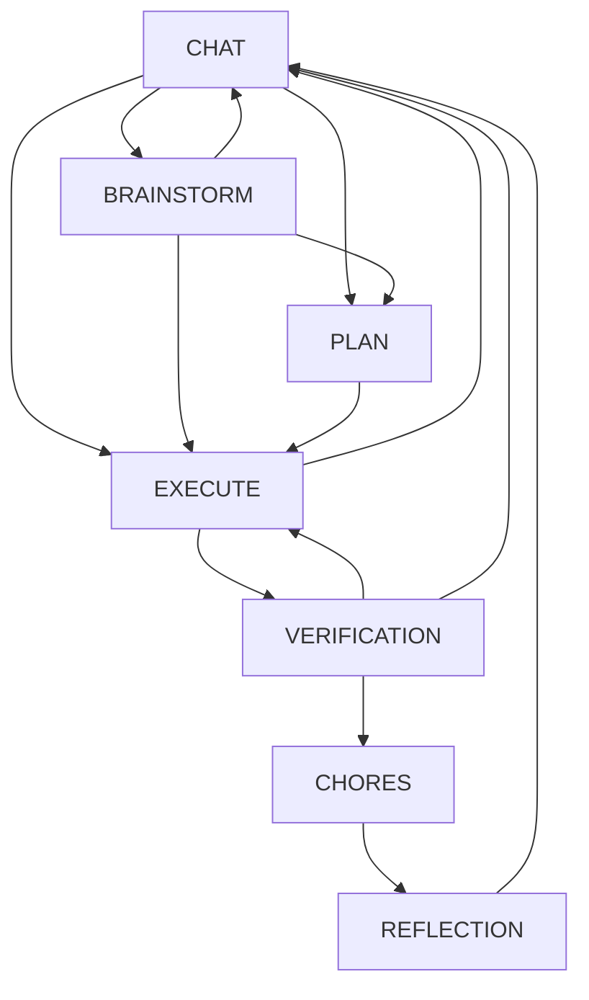

# TENEX Workflow Management Architecture

## Table of Contents
1. [Executive Summary](#executive-summary)
2. [Core Architecture](#core-architecture)
3. [Phase-Based State Machine](#phase-based-state-machine)
4. [Workflow Execution Pipeline](#workflow-execution-pipeline)
5. [Agent Orchestration](#agent-orchestration)
6. [Termination and Completion](#termination-and-completion)
7. [State Management](#state-management)
8. [Error Recovery](#error-recovery)
9. [Performance Considerations](#performance-considerations)
10. [Implementation Patterns](#implementation-patterns)
11. [Open Questions](#open-questions)

## Executive Summary

The TENEX workflow management system implements a sophisticated phase-based multi-agent orchestration architecture that controls the entire lifecycle of task execution. Unlike traditional workflow engines, TENEX uses an **invisible orchestrator pattern** where routing complexity is completely hidden from users, presenting a seamless conversational interface while maintaining strict quality control through mandatory phase transitions.

### Key Innovations

1. **Phase-Based Quality Gates**: Enforces a mandatory sequence (EXECUTE → VERIFICATION → CHORES → REFLECTION) ensuring systematic quality control
2. **Invisible Orchestration**: Routing decisions occur silently behind the scenes without user visibility
3. **Streaming Execution**: Real-time feedback through streaming responses with parallel tool execution
4. **Self-Correcting Behavior**: Automatic recovery from routing errors with learning capabilities
5. **Termination Enforcement**: Guarantees proper task completion through retry mechanisms

## Core Architecture

### Conceptual Model

```
┌─────────────────────────────────────────────────────────────┐
│                      User Interface                          │
│                   (Conversational Layer)                     │
└─────────────────────────────────────────────────────────────┘
                              │
                              ▼
┌─────────────────────────────────────────────────────────────┐
│                   Conversation Manager                       │
│         (State Management & Context Building)                │
└─────────────────────────────────────────────────────────────┘
                              │
                              ▼
┌─────────────────────────────────────────────────────────────┐
│                      Orchestrator                            │
│              (Invisible Routing Engine)                      │
└─────────────────────────────────────────────────────────────┘
                              │
                    ┌─────────┴─────────┐
                    ▼                   ▼
        ┌──────────────────┐  ┌──────────────────┐
        │  Agent Executor   │  │  Agent Executor   │
        │   (Backend Loop)  │  │   (Backend Loop)  │
        └──────────────────┘  └──────────────────┘
                    │                   │
                    ▼                   ▼
        ┌──────────────────┐  ┌──────────────────┐
        │   Domain Agent    │  │   Domain Agent    │
        │  (Task Execution) │  │  (Task Execution) │
        └──────────────────┘  └──────────────────┘
```

### Component Responsibilities

1. **ConversationManager** (`src/conversations/ConversationManager.ts`)
   - Maintains conversation state and history
   - Builds agent-specific message contexts
   - Tracks phase transitions and orchestrator turns
   - Manages agent states and session continuity

2. **Orchestrator Agent** (`src/agents/built-in/orchestrator.ts`)
   - Analyzes user requests and determines routing
   - Makes phase transition decisions
   - Coordinates multi-agent collaboration
   - Never directly interacts with users

3. **AgentExecutor** (`src/agents/execution/AgentExecutor.ts`)
   - Selects appropriate execution backend
   - Manages agent lifecycle
   - Handles streaming and tool execution
   - Enforces termination requirements

4. **Execution Backends**
   - **ReasonActLoop**: Standard streaming execution with tool support
   - **RoutingBackend**: Orchestrator-specific routing logic
   - **ClaudeBackend**: Direct Claude passthrough for stateful sessions

## Phase-Based State Machine

### Phase Definitions

The system operates through seven distinct phases, each with specific purposes and constraints:

```typescript
export const PHASES = {
    CHAT: "chat",           // Requirements gathering and clarification
    BRAINSTORM: "brainstorm", // Creative exploration and ideation
    PLAN: "plan",           // Architectural design and planning
    EXECUTE: "execute",     // Implementation and work execution
    VERIFICATION: "verification", // Functional testing from user perspective
    CHORES: "chores",       // Documentation and cleanup
    REFLECTION: "reflection" // Learning capture and insights
}
```

### Phase Transition Rules



### Quality Enforcement Sequence

After task execution, the system **mandatorily** enforces:

1. **VERIFICATION**: Functional testing to ensure requirements are met
2. **CHORES**: Documentation updates and cleanup
3. **REFLECTION**: Learning capture from all participating agents

This sequence cannot be bypassed, ensuring consistent quality control.

## Workflow Execution Pipeline

### Request Processing Flow

```
1. User Message (NDKEvent)
   ↓
2. ConversationManager.handleEvent()
   - Create/update conversation
   - Initialize tracing context
   - Log conversation start
   ↓
3. Orchestrator Analysis (RoutingBackend)
   - Parse routing context JSON
   - Determine target agents and phase
   - Start orchestrator turn
   ↓
4. Agent Selection & Execution
   - Find target agents by normalized names
   - Create execution contexts
   - Execute via AgentExecutor
   ↓
5. Streaming Execution (ReasonActLoop)
   - Stream LLM responses
   - Execute tools in parallel
   - Handle termination
   ↓
6. Completion Handling
   - Agent calls complete() tool
   - Routes back to orchestrator
   - Updates orchestrator turn
   ↓
7. Next Routing Decision
   - Orchestrator analyzes completions
   - Determines next agents/phase
   - Continues workflow
```

### Execution Context Flow

Each agent execution receives a carefully constructed context:

```typescript
interface ExecutionContext {
    conversationId: string;
    agent: Agent;
    phase: Phase;
    triggeringEvent?: NDKEvent;
    tracingContext: TracingContext;
    publisher: NostrPublisher;
    agentExecutor?: AgentExecutor; // For nested execution
}
```

## Agent Orchestration

### Invisible Orchestrator Pattern

The orchestrator operates as a completely invisible routing layer:

1. **Never speaks to users** - All communication is agent-to-agent
2. **Receives structured JSON** - Not conversation transcripts
3. **Returns only routing decisions** - No user-visible content

#### Orchestrator Input Format

The orchestrator receives a workflow narrative as text that contains:
- The user's request
- Complete workflow history showing what agents have done
- Full completion messages from agents
- Current status and phase information

```typescript
interface OrchestratorRoutingContext {
    user_request: string;  // Original user request that started the conversation
    workflow_narrative: string;  // Human-readable narrative of conversation flow and agent interactions
}
```

#### Orchestrator Output Format

```json
{
    "agents": ["target-agent-1", "target-agent-2"],
    "phase": "target-phase",
    "reason": "Explanation of routing decision"
}
```

### Multi-Agent Coordination

The system supports three coordination patterns:

1. **Sequential Routing**
   ```
   Orchestrator → Agent1 → Orchestrator → Agent2
   ```
   Used for dependent tasks requiring ordered execution

2. **Parallel Routing**
   ```
   Orchestrator → [Agent1, Agent2] → Orchestrator
   ```
   Used for independent tasks that can execute simultaneously

3. **Feedback Loops**
   ```
   Orchestrator → Executor → Orchestrator → Expert → Orchestrator → Executor
   ```
   Used for iterative refinement and error correction

### Orchestrator Turn Management

Each routing decision creates an "orchestrator turn" that tracks:

```typescript
interface OrchestratorTurn {
    turnId: string;           // Unique turn identifier
    timestamp: number;        // When turn started
    phase: Phase;            // Target phase
    agents: string[];        // Agents to execute
    completions: Completion[]; // Agent completion records
    reason?: string;         // Routing rationale
    isCompleted: boolean;    // All agents completed?
}
```

This enables:
- Tracking which agents should respond
- Ensuring all agents complete before next routing
- Maintaining audit trail of decisions

## Termination and Completion

### Termination Requirements

Different phases have different termination requirements:

- **CHAT/BRAINSTORM**: No termination required (conversational)
- **Other Phases**: MUST call `complete()` tool or face auto-completion

### Termination Enforcement Flow

```
1. Agent Execution Completes
   ↓
2. Check Termination Status
   ├─ Terminated: Continue normally
   └─ Not Terminated: Enter retry loop
       ↓
3. Retry Loop (Max 3 attempts)
   ├─ Attempt 1: Continue without intervention
   ├─ Attempt 2: Add reminder message
   └─ Attempt 3: Final reminder
       ↓
4. Auto-Completion (if still not terminated)
   - Generate completion from accumulated content
   - Mark as system auto-completed
   - Route back to orchestrator
```

### Reminder Messages

**For Non-Orchestrator Agents:**
```
"I see you've finished responding, but you haven't used the 'complete' tool yet. 
As a non-orchestrator agent, you MUST use the 'complete' tool to signal that 
your work is done and report back to the orchestrator."
```

**For Orchestrator (should never happen):**
```
"I see you've finished processing, but you haven't provided routing instructions yet. 
As the orchestrator, you MUST route to appropriate agents for the next task."
```

### Completion Handler

The `complete()` tool performs these actions:

1. **Publishes completion event** with summary to orchestrator
2. **Updates orchestrator turn** with completion record
3. **Sets termination flag** in execution state
4. **Returns control** to orchestrator for next routing

## State Management

### Conversation State

```typescript
interface Conversation {
    id: string;
    title: string;
    phase: Phase;
    history: NDKEvent[];
    agentStates: Map<string, AgentState>;
    phaseTransitions: PhaseTransition[];
    orchestratorTurns: OrchestratorTurn[];
    executionTime: ExecutionTimeTracking;
    metadata: ConversationMetadata;
}
```

### Agent State Tracking

Each agent maintains its own view of the conversation:

```typescript
interface AgentState {
    lastProcessedMessageIndex: number;  // Position in history
    claudeSessionId?: string;          // For session continuity
}
```

This enables:
- **Incremental message processing** - Agents only see new messages
- **Session continuity** - Claude backend maintains context
- **Parallel execution** - Multiple agents with independent states

### Message Building Strategy

The ConversationManager builds agent-specific message contexts:

1. **Historical Messages**: All messages up to triggering event
2. **Own Messages**: Added as "assistant" role
3. **User Messages**: Added as "user" role  
4. **Other Agent Messages**: Added as "system" with attribution
5. **Unprocessed Messages**: Marked as "MESSAGES WHILE YOU WERE AWAY"

### Phase Transition Records

```typescript
interface PhaseTransition {
    from: Phase;
    to: Phase;
    message: string;
    timestamp: number;
    agentPubkey: string;
    agentName: string;
    reason?: string;
    summary?: string;
}
```

Transitions are recorded for:
- **Audit trail** of workflow progression
- **Context for agents** about phase changes
- **Analytics** on workflow patterns

## Error Recovery

### Multi-Level Recovery System

1. **Agent Name Validation**
   ```typescript
   // Fuzzy matching with feedback
   findAgentByName(agents, requestedName)
   // If not found, send correction feedback
   sendRoutingFeedback(context, invalidName, availableAgents)
   ```

2. **Execution Failures**
   ```typescript
   try {
       await agentExecutor.execute(targetContext);
   } catch (error) {
       // Log but continue with other agents
       tracingLogger.error("Failed to execute target agent", {...});
       // Don't fail entire routing
   }
   ```

3. **Parsing Errors**
   ```typescript
   // Extract JSON from markdown if needed
   const jsonMatch = content.match(/```json\n([\s\S]*?)\n```/);
   // Fallback to direct parsing
   const parsed = JSON.parse(jsonMatch?.[1] || content);
   ```

4. **State Recovery**
   ```typescript
   // Handle missing agent states
   if (!agentState) {
       agentState = { lastProcessedMessageIndex: 0 };
       conversation.agentStates.set(targetAgent.slug, agentState);
   }
   ```

### Self-Correcting Behavior

The orchestrator learns from routing mistakes:

1. **Invalid Agent Names**: Receives list of valid agents for future reference
2. **Failed Executions**: Can re-route to alternative agents
3. **Loop Detection**: Identifies repetitive patterns and escalates
4. **Phase Violations**: Automatically corrects invalid transitions

## Performance Considerations

### Streaming Optimization

1. **Immediate Feedback**: Users see responses as they're generated
2. **Parallel Tool Execution**: Tools run concurrently, not sequentially
3. **Stream State Management**: Efficient accumulation without memory bloat
4. **Publisher Reuse**: Stream publishers maintained across retries

### Resource Management

1. **Bounded Retries**: Maximum 3 termination attempts
2. **Timeout Controls**: Tool execution timeouts prevent hanging
3. **State Cleanup**: Conversation metadata cleaned on completion
4. **Selective Message Building**: Only relevant history included

### Concurrency Patterns

1. **Parallel Agent Execution**: Multiple agents can work simultaneously
2. **Async Tool Operations**: Non-blocking tool execution
3. **Stream Multiplexing**: Single stream serves multiple consumers
4. **Event-Driven Updates**: Reactive state updates via Nostr events

## Implementation Patterns

### Backend Selection Pattern

```typescript
// AgentExecutor selects backend based on agent type
private selectBackend(agent: Agent): ExecutionBackend {
    if (agent.isOrchestrator) {
        return new RoutingBackend(this.llmService, this.conversationManager);
    }
    if (agent.claudeSessionId) {
        return new ClaudeBackend(this.llmService);
    }
    return new ReasonActLoop(this.llmService, this.conversationManager);
}
```

### Stream Processing Pattern

```typescript
// Process stream events with state management
for await (const event of stream) {
    switch (event.type) {
        case "content":
            stateManager.appendContent(event.content);
            streamPublisher?.publishChunk(event.content);
            break;
        case "tool_use":
            await toolHandler.handleToolUse(event, tools);
            break;
        case "error":
            await this.handleError(event.error);
            break;
    }
}
```

### Completion Pattern

```typescript
// Consistent completion handling
async function handleAgentCompletion(options: CompletionOptions) {
    // Track in orchestrator turn
    await conversationManager.addCompletionToTurn(...);
    
    // Publish completion event
    await publisher.publishResponse({
        content: response,
        destinationPubkeys: [orchestrator.pubkey],
        additionalTags: [["tool", "complete"]],
        completeMetadata: {...}
    });
    
    // Return termination signal
    return { type: "complete", completion: {...} };
}
```

## Open Questions

Despite comprehensive analysis, several architectural questions remain:

### 1. Orchestrator Turn Completion
- **Question**: How does the system handle partially completed orchestrator turns when some agents fail?
- **Current Behavior**: Turn marked incomplete, but unclear if retry mechanism exists
- **Impact**: Could lead to stuck workflows if not properly handled

### 2. Phase Transition Validation
- **Question**: Where is phase transition validation enforced beyond the defined rules?
- **Current Behavior**: Rules defined in `PHASE_TRANSITIONS` but enforcement point unclear
- **Impact**: Invalid transitions might occur without proper validation

### 3. Session ID Management
- **Question**: How are Claude session IDs generated and when are they cleared?
- **Current Behavior**: Stored in agent state but lifecycle management unclear
- **Impact**: Could affect conversation continuity and context management

### 4. Parallel Agent Coordination
- **Question**: How does the system handle conflicts when parallel agents modify same resources?
- **Current Behavior**: Agents execute independently without apparent locking
- **Impact**: Potential race conditions in resource modification

### 5. Termination Timeout
- **Question**: Is there a global timeout for agent execution beyond termination retries?
- **Current Behavior**: 3 retry attempts but no apparent time-based timeout
- **Impact**: Long-running agents could block workflow progression

### 6. Error Propagation
- **Question**: How do agent execution errors propagate to user visibility?
- **Current Behavior**: Errors logged but user notification path unclear
- **Impact**: Users might not know when errors occur

### 7. Workflow Rollback
- **Question**: Can workflows be rolled back to previous phases on critical errors?
- **Current Behavior**: Forward-only progression apparent
- **Impact**: No recovery path for catastrophic failures

### 8. Message Context Limits
- **Question**: How does the system handle context window limits for long conversations?
- **Current Behavior**: Full history included but truncation strategy unclear
- **Impact**: Could hit LLM context limits in long conversations

### 9. Orchestrator Learning
- **Question**: Where is orchestrator learning/feedback actually stored and utilized?
- **Current Behavior**: Feedback sent but persistence/retrieval unclear
- **Impact**: Learning might not persist across conversations

### 10. END Agent Handling
- **Question**: How does the special "END" agent interact with the phase system?
- **Current Behavior**: Terminates conversation but phase state unclear
- **Impact**: Might bypass quality gates (verification/reflection)

## Conclusion

The TENEX workflow management system represents a sophisticated approach to multi-agent task orchestration that successfully balances automation with quality control. The phase-based architecture ensures systematic progression through complex tasks while the invisible orchestrator pattern maintains a clean user experience.

Key strengths include:
- **Enforced quality gates** through mandatory phase transitions
- **Robust error recovery** with self-correcting behavior
- **Real-time feedback** through streaming execution
- **Flexible coordination** supporting various collaboration patterns

The system's architecture demonstrates thoughtful design in separating concerns between orchestration, execution, and domain logic while maintaining clear boundaries and responsibilities across components.